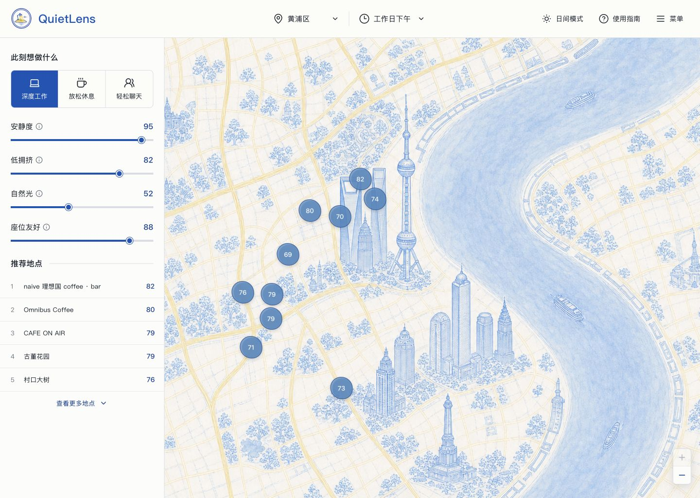

<p align="center">
  
</p>

<h1 align="center">QuietLens</h1>

<p align="center">
  An evidence-backed place decision agent for finding lower-friction work and recovery spaces.<br>
  It does not ask which café is most popular. It asks which place is less likely to disrupt what you need to do right now.
</p>

<p align="center">
  
  
  
  
  
</p>

<p align="center">
  <a href="#what-quietlens-does"><strong>Product overview</strong></a>
  ·
  <a href="#run-locally"><strong>Run locally</strong></a>
  ·
  <a href="https://github.com/HiWhaleW/QuietLens/issues"><strong>Report an issue</strong></a>
</p>

> [!NOTE]
> QuietLens is an experimental desktop portfolio prototype. Its current evidence boundary is a controlled set of 10 cafés in Huangpu, Shanghai; it is not comprehensive coverage of Shanghai.

> [!IMPORTANT]
> **Not medical advice and not a real-time availability service.** QuietLens does not diagnose sensory conditions or guarantee current seating, noise, crowd levels, opening hours, or accessibility. Verify time-sensitive details before travelling.

## What QuietLens does

QuietLens turns a natural-language request into a bounded, inspectable place decision. A user can describe the task, time, area, walking limit, hard constraints, and sensory preferences in their own words. The system then:

1. extracts a visible, editable intent summary;
2. asks one clarification when the interpreted request is incomplete, with a hard limit of one question;
3. filters a controlled place set with deterministic hard constraints;
4. retrieves only eligible evidence;
5. returns two or three comparable decision briefs by default, or one confirmed option when a strict hard constraint leaves only one eligible candidate;
6. shows trade-offs, assumptions, unknowns, confidence, and evidence scope; and
7. accepts a correction without forcing the user to restart.

The product never exposes hidden chain-of-thought. Explanations are limited to concise, verifiable decision grounds.

## The AI-native loop

```text
Natural-language request
→ editable Decision Request
→ one clarification when required fields remain incomplete
→ deterministic hard-constraint filter
→ controlled evidence retrieval
→ model-assisted comparison
→ deterministic verification and rendering
→ user correction
```

AI is necessary for interpreting ambiguous intent, comparing heterogeneous evidence, and understanding incremental corrections. It is not the factual source and does not control the safety boundaries.

## Core experience

| Capability | What the user gets |
| --- | --- |
| Natural-language entry | Describe the situation without translating it into a complex filter form. |
| Editable intent summary | Inspect and correct the task, arrival time, area, walking limit, and priorities. |
| Mandatory clarification, one-round maximum | If the visible structured request remains incomplete after extraction, ask for the highest-priority missing information once; never ask a second question. |
| One to three decision briefs | Compare two or three options by default without a fake ten-place ranking; when a strict hard constraint leaves one confirmed option, show that option without padding the result with unknown candidates. |
| Evidence-backed explanations | Inspect localized decision grounds, verification dates, reliability, and source links without exposing internal model text. |
| Map-first exploration | Keep all 10 registered cafés selectable without changing the published recommendation order. |
| Store-specific detail | Open a café to see its role in the current decision and its bounded sensory profile. |
| Watercolor place reveal | Expand a selected café through an original torn-paper watercolor scene. |
| Correction loop | Add or revise a condition while preserving the rest of the Decision Request. |

## AI and deterministic responsibilities

| Model-assisted | Deterministic |
| --- | --- |
| Interpret ambiguous natural language | Validate the Decision Request schema |
| Interpret which unresolved field the user is addressing | Decide whether the request is incomplete, prioritize the clarification target, and enforce the one-question limit |
| Compare retrieved evidence across candidates | Apply candidate allowlists and hard constraints |
| Draft bounded reasons and trade-offs | Verify citation existence and evidence eligibility |
| Understand an incremental correction | Enforce confidence ceilings and render the final brief |

Missing evidence is never treated as proof that a condition is satisfied. Reviews, webpages, and user-provided text are untrusted inputs until they pass the evidence pipeline.

## Current evidence boundary

- 10 controlled cafés in Huangpu, Shanghai
- public, traceable source material organized into atomic evidence records
- explicit separation between facts, sourced observations, editorial references, conflicts, and unknowns
- no claim of real-time seating, sound level, crowding, or opening status
- no open-ended place generation outside the controlled candidate set

The watercolor map and café scenes are product assets, not evidence. Third-party research photographs and private source registries are not included in this repository.

## Run locally

Requirements:

- Node.js 20+
- npm
- a server-side DeepSeek API key only when exercising the live model-backed decision flow

```bash
git clone https://github.com/HiWhaleW/QuietLens.git
cd QuietLens
npm install
npm run build
npm run serve:local
```

Open `http://127.0.0.1:4173/`.

Store the key only in a local `.env.local` file:

```text
DEEPSEEK_API_KEY=your_key_here
```

The key is read by the server-side worker. Never prefix it with `VITE_`, expose it to client code, or commit the environment file.

The optional Stage 2 Evidence review boundary remains disabled by default. Supabase project configuration belongs in `.env.local`; a service-role key must remain server-only and must never use a `VITE_` prefix. See `.env.example` for the supported variable names and safe defaults.

For interface-only development:

```bash
npm run dev
```

## Architecture

- React 19 and Vite 6
- a bounded Intent Interpreter and Decision Reasoner
- deterministic request validation, hard-constraint filtering, evidence verification, and rendering
- versioned Evidence source, snapshot, candidate, conflict, and human-review contracts
- server-side model calls through a Responses API adapter
- an optional, default-off Supabase Auth/Postgres reviewer boundary with MFA and append-only audit controls
- versioned, privacy-minimized analytics that exclude raw requests, precise personal locations, and hidden reasoning
- three discrete watercolor map boards: Shanghai overview, central city, and Huangpu detail
- desktop-first interface with a restrained notice below 1180 px
- reduced-motion support for the torn-paper café reveal

## Repository layout

```text
src/ai-native/       contracts, retrieval, verification, state, and AI-native UI
worker/              server-side decision routes, model adapters, and analytics
supabase/             default-off reviewer authorization and audit-ledger migration
scripts/              reproducible build, evidence, evaluation, and release checks
public/assets/map/   original watercolor map boards
public/assets/cafes/ original watercolor café scenes
tests/               contract, safety, evaluation, analytics, and hosting checks
media/               public README assets
```

## Validation

```bash
npm run test:phase3d
npm run build
```

Live-model evaluation requires a local API key and is intentionally separate from deterministic regression tests.

## Privacy and security

- Environment files, local research, internal documentation, generated evaluation reports, and build output are excluded from Git.
- Raw natural-language requests, exact personal locations, hidden reasoning, and API credentials must not be logged.
- Model output cannot bypass the place allowlist, evidence eligibility rules, citation checks, or hard constraints.
- Reviewer identities and service-role credentials remain server-side; the production review API is disabled until MFA, scoped grants, backups, and a controlled rehearsal are verified.
- The public repository contains no private API key or local machine path.

## License

Copyright © 2026 QuietLens. All rights reserved.

Public availability does not grant permission to copy, modify, distribute, sublicense, or use this project commercially. See [LICENSE](LICENSE) for the complete terms.
